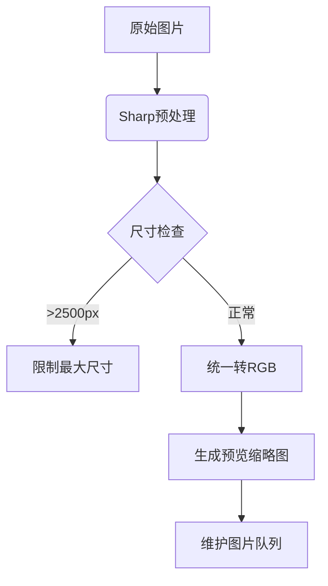

# 在线图片转PDF网站技术方案

## 一、技术架构设计

### 1. 前端技术栈
```
▢ Next.js 14 (App Router)  
▢ React 18 + TypeScript  
▢ Tailwind CSS + Framer Motion (科技感动效)  
▢ react-dropzone (文件上传组件)  
▢ react-beautiful-dnd (拖拽排序)  
▢ pdf-lib (客户端PDF生成)  
▢ Sharp (图像处理WASM版)
```

### 2. 后端服务
```
▢ Vercel Serverless Functions  
▢ 无数据库设计（文件处理完全在内存中完成）
```

### 3. 核心功能实现方案

#### 文件上传模块
```typescript
// 支持格式：JPG/PNG/WEBP/AVIF/BMP/TIFF
const ACCEPTED_MIME_TYPES = [
  'image/jpeg',
  'image/png',
  'image/webp',
  'image/avif',
  'image/bmp',
  'image/tiff'
];

// 双模式上传逻辑
<Dropzone 
  maxFiles={50}
  onDrop={handleFileDrop}
  accept={ACCEPTED_MIME_TYPES}
>
  {({getRootProps}) => (
    <div 
      className="cyberpunk-border" 
      {...getRootProps()}
    >
      <UploadButton />
    </div>
  )}
</Dropzone>
```

#### 图片处理流水线


#### PDF生成策略
```
▢ 客户端生成：<10张图片时使用pdf-lib  
▢ 服务端生成：>10张时调用Sharp+PDFKit  
▢ 分页压缩策略：根据图片尺寸自动优化DPI
```

## 二、SEO深度优化方案
网站以地道的英语为目标语言，

### 1. 核心元数据
```html
<title>Lightning PDF Converter - Online Image to PDF Tool | {Brand Name}</title>
<meta name="description" content="Free online tool to convert JPG/PNG/WEBP and other image formats to PDF, with batch processing and smart sorting while preserving original quality">
<meta property="og:image" content="https://cdn.example.com/og-image-v3.jpg">
```

### 2. 语义化结构
```html
<article itemscope itemtype="https://schema.org/WebApplication">
  <meta itemprop="applicationCategory" content="Productivity"/>
  <div itemprop="screenshot" content="preview-screenshot.jpg"></div>
  <link itemprop="downloadUrl" href="/api/converter"/>
</article>
```

### 3. 内容优化策略
```
▢ LCP优化：预加载首屏3D动画资源  
▢ 动态生成FAQ schema标记  
▢ 构建工具页：/image-to-pdf-guide  
▢ 多语言备用链接：hreflang标签
```

## 三、性能优化措施

### 1. 核心Web指标保障
```
▢ 图片预压缩：所有示例图片经过Squoosh处理  
▢ WASM加速：Sharp处理核心迁移到WebAssembly  
▢ 虚拟滚动：超过20张时启用动态加载  
▢ SWR策略：高频API请求缓存
```

### 2. 缓存策略
```vercel.json
{
  "headers": [
    {
      "source": "/api/(.*)",
      "headers": [
        {
          "key": "CDN-Cache-Control",
          "value": "public, s-maxage=86400"
        }
      ]
    }
  ]
}
```

## 四、安全防护方案

### 1. 文件安全处理
```typescript
// 恶意文件检测逻辑
const validateFile = (file: File) => {
  const signature = await readFileHeader(file);
  if(!VALID_SIGNATURES.includes(signature)) {
    throw new Error('INVALID_FILE_TYPE');
  }
  
  if(file.size > 50 * 1024 * 1024) {
    throw new Error('FILE_SIZE_EXCEEDED');
  }
}
```

### 2. 安全标头
```vercel.json
{
  "headers": [
    {
      "source": "/(.*)",
      "headers": [
        {
          "key": "Content-Security-Policy",
          "value": "default-src 'self'; script-src 'sha256-...'"
        }
      ]
    }
  ]
}
```

## 五、部署架构

### Vercel配置方案
```vercel.json
{
  "build": {
    "env": {
      "NEXT_PUBLIC_GA_ID": "@ga-tracking-id",
      "IMAGE_PROXY_KEY": "@image-proxy-secret"
    }
  },
  "routes": [
    {
      "src": "/convert",
      "dest": "/api/converter?limit=50",
      "methods": ["POST"]
    }
  ]
}
```

### 边缘网络优化
```
▢ 启用Vercel Image Optimization CDN  
▢ 配置全球边缘节点缓存规则  
▢ 开启Brotli压缩
```

## 六、监控分析体系

### 1. 核心埋点事件
```typescript
// 转换成功埋点
track('conversion_success', {
  file_count: files.length,
  total_size: totalMB,
  device_type: isMobile ? 'mobile' : 'desktop'
});

// 错误捕获
window.addEventListener('error', (e) => {
  sentry.captureException(e.error);
});
```

### 2. 性能监控
```javascript
// Web Vitals集成
reportWebVitals((metric) => {
  analytics.track(metric.name, metric.value);
});
```

## 七、科技感UI设计方案

### 视觉系统
```
▢ 主色调：#6366f1 → #8b5cf6 渐变  
▢ 辅助元素：流动光效 + 微交互粒子  
▢ 动态组件：
   - 上传区全息投影效果
   - 文件列表的AR Hover效果
   - 转换进度可视化（3D环形图）
```

### 动效规范
```css
.cyberpunk-button {
  transition: all 0.3s cubic-bezier(0.4, 0, 0.2, 1);
  box-shadow: 0 0 15px rgba(99, 102, 241, 0.5);
}

.cyberpunk-button:hover {
  transform: skewX(-5deg);
  filter: hue-rotate(15deg);
}
```
